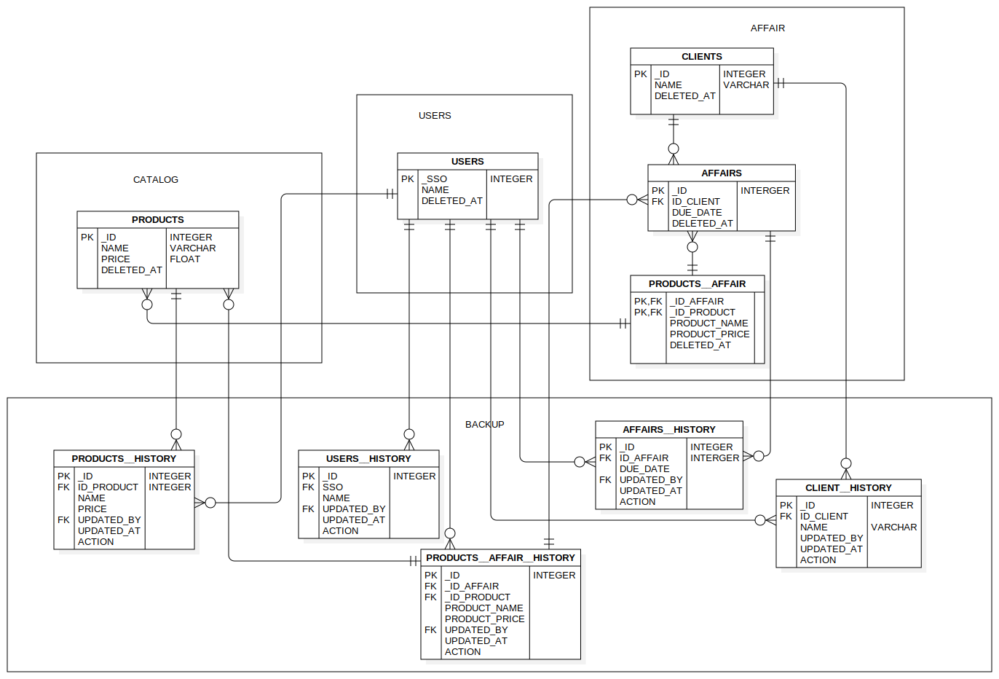

# QCS : Quality Control System

## Introduction
This is only a proof of concept of the actual Quality Control System. The actual system will be developed in the future.
You can think of this as a sandbox for the actual system. It is used to test the different functionalities of the system.

## ERD
The ERD of the system is as follows:

## Tech Stack
#### Backend:
- Spring Boot 
- Hibernate
- JPA
- PostgreSQL
- Java 17
- Maven
- JUnit

### Frontend:
- Angular

